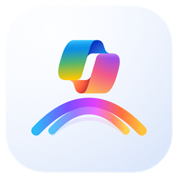
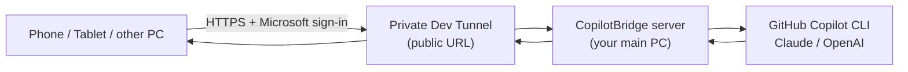

# CopilotBridge

**Use your AI coding subscription (GitHub Copilot CLI / Claude / OpenAI) from
any device — your phone, tablet, or another PC — by bridging it through your
main computer.**

CopilotBridge runs a tiny server on the machine where your AI CLI is installed,
then exposes it over a secure Microsoft **Dev Tunnel** so your other devices can
talk to it from anywhere. Install it with one click, sign in once, and you get a
URL + key to paste into the mobile/desktop apps.

<p align="center">
  
</p>



---

## Why use it

### 1. Share your AI subscription with all your devices — and vibe-code from your phone
You already pay for GitHub Copilot (or Claude / OpenAI) on your main computer.
CopilotBridge lets your **phone, tablet, or laptop** use that same subscription
remotely. Got an idea on the couch? Open the app on your phone, type a prompt,
and your home PC's Copilot does the work — real **vibe coding from your phone**,
backed by the full power of your desktop's tools and files.

### 2. One shared AI history across every device — save tokens and context
Every device talks to the **same** server, so they share **one set of
conversation histories**. Start a session on your laptop, continue it on your
phone, finish it on a tablet — the context is already there. No re-explaining,
no duplicate sessions, **less wasted compute and fewer tokens**.

Other niceties: persistent sessions that survive restarts, image attachments
(send a screenshot, the AI can see it), Markdown rendering, and a request queue
so multiple devices don't collide. Machine-aware History can hide conversations
with no more than two user prompts by default, without deleting their data.

---

## Prerequisites (host PC)

- **An AI CLI**, installed and signed in — e.g. **GitHub Copilot CLI**
  (`copilot --version`), Claude CLI, or an OpenAI key. This is the subscription
  you're sharing.
- **Windows** for the one-click installer. (From source also needs **Python
  3.12+**; the Windows client needs the **.NET 9 SDK**.)
- **Dev Tunnels** — bundled with the installer; just sign in once.

---

## Install (Windows, one click)

> You need this on the **host PC** — the computer that has your AI CLI
> (e.g. GitHub Copilot CLI) installed and signed in. Your other devices only
> need the client app or a browser.

1. **Download** the latest `CopilotBridgeServer-x.y.z-setup.exe` from the
   [**Releases**](../../releases/latest) page.
2. **Run the installer.** It installs to `Program Files`, adds Start-menu
   shortcuts, and launches the app. (Windows SmartScreen may warn for a new
   publisher — choose *More info → Run anyway*.)
3. **First-run setup wizard** (all in a window — no command line):
   - **Dev Tunnel** — click **Sign in** (free, opens your browser) so your phone
     can reach the server from anywhere. You can also skip for LAN-only.
   - **AI tool** — pick GitHub Copilot (recommended), Claude, etc.
   - Click **Start server →**.
4. Copilot Bridge opens its **AI Dashboard** in your default browser:
   - Click **Allow browser notifications**, then choose **Allow** in the browser
     prompt. Browsers require this one user click and do not permit installers
     to grant site notification access silently.
   - Click **Connect OneDrive** and deliberately choose the personal or work
     account where Bridge history should live. When the OneDrive desktop client
     is already signed in, Bridge automatically uses its local synchronized
     folder without another OAuth login. The first sync imports this PC's existing
     Copilot CLI, VS Code, and VS Code Insiders sessions, uploads them, then
     downloads and merges sessions already uploaded by another PC. Neither side
     is overwritten.
5. A **Connection info** window appears with your **Server URL**, **API Key**,
   and provider — each with a **Copy** button. Paste these into the client app
   on your phone/PC (or open the Server URL in a phone browser for the built-in
   web app).

That's it. Closing the window keeps the server running in the background.

### Control Panel — start / stop / restart anytime

Open **Start menu → Copilot Bridge → Copilot Bridge Control Panel**. From one
window you can:

| Control | What it does |
| --- | --- |
| **Server: Start / Stop / Restart** | Manually control the CopilotBridge server. |
| **Dev Tunnel: Start / Stop / Restart** | Pause or re-establish the public URL (it also self-heals if it ever drops). |
| **Connection details + Copy** | See the current Server URL / Local URL / API Key. |
| **OneDrive: Connect / Upload + download / Disconnect** | Run first sync, inspect pending events, or manually synchronize both directions. |
| **Open AI Dashboard** | Open the browser session dashboard from the native console. |

There's also a **View Connection Info** shortcut that shows the URL + key any
time without changing anything. The server keeps running in the background and
restarts at logon, so it's there whenever your devices need it.

---

## Connect a device

- **Phone (no install):** open the **Server URL** in your phone's browser → it
  loads the built-in web app (add it to your Home Screen for an app-like PWA).
  Paste the **API Key** once in Settings.
- **Windows client:** a native desktop app (see [`clients/windows/`](clients/windows/)).
  Enter the Server URL + API Key in Settings.
- **Android / iOS:** .NET MAUI apps under [`clients/`](clients/) (build from
  source; see [`clients/README.md`](clients/README.md)).

All clients share the same server, so they all see the same session history.

---

## Security (please read)

CopilotBridge is effectively **remote command execution** on the host PC. Keep
its ingress and control credentials protected:

- Local web access is bound to `localhost` and does not require a login.
- Remote access uses a private Dev Tunnel and requires the Microsoft account that
  owns the tunnel. Do not switch it to anonymous unless legacy API-key mode is intended.
- Keep the generated control API key secret; the browser does not need or receive it.
- The default AI sandbox is the server's `workspace/` folder
  (`COPILOT_SCOPE=workdir`). Only widen it if you understand the risk.
- Stop the tunnel from the Control Panel when you don't need remote access.
- OneDrive sync requests only `Files.ReadWrite.AppFolder`. Its MSAL token cache
  is encrypted for the current Windows user with DPAPI and never stored in
  SQLite or `.env`. Disconnecting OneDrive keeps local conversations and Outbox.
- In default `auto` mode, a configured publisher Graph Client ID uses App Folder
  authorization; otherwise Bridge uses the already signed-in local OneDrive
  folder under `Apps\Copilot Bridge`. A tenant-local test Client ID is never used
  as a production fallback.

---

## For developers

> The supported way to run CopilotBridge is the **one-click installer** above.
> Running the raw server from source is not recommended for normal use.

Build an installer that can be copied to another Windows PC:

```powershell
.\scripts\install.ps1
.\scripts\build-installer.ps1 -Version 2.2.3
```

The Microsoft edition produces
`dist\copilotbridgeserver-ms-2.2.3-setup.exe`. It contains the server runtime,
native Control Panel, web Dashboard, Dev Tunnel CLI, SQLite migrations, and
OneDrive synchronization modules; the target PC does not need Python. The
desktop shortcut opens the Control Panel after installation.

### Repository layout

| Path | What it is |
| --- | --- |
| [`server/`](server/) | Python aiohttp server, orchestrated launcher, GUI (setup wizard / connection info / Control Panel), Dev Tunnel + provider plumbing. |
| [`clients/`](clients/) | End-user apps: Windows (WPF) and Android / iOS (.NET MAUI). |
| [`installer/`](installer/) | Inno Setup script for the one-click installer. |
| [`scripts/`](scripts/) | Install, run, build-installer, publish, background-service scripts. |
| [`assets/`](assets/) | App icon (`icon.svg` / `icon.ico`). |
| [`docs/`](docs/) | Architecture, releasing, and deeper notes. |

### The HTTP API (used by every client)

| Route | Body | Returns |
| --- | --- | --- |
| `GET /health` | — | status JSON (no auth) |
| `POST /api/chat` | `{message, conversationId, reset?, images?}` | `{jobId}` |
| `GET /api/chat/{jobId}` | — | `{status, ok, reply, sessionId, title}` |
| `POST /api/chat-sync` | `{message, conversationId, ...}` | `{ok, reply, sessionId, title}` (waits) |
| `GET/POST /api/sessions`, `GET/PATCH/DELETE /api/sessions/{id}` | — | session list / detail CRUD |
| `GET /api/sessions/{id}/turns` | `?previewLength?` | stable prompt timeline with Turn ids |
| `GET/PATCH /api/settings` | `{promptPreviewLength?}` | user settings |
| `GET /api/dashboard` | — | active jobs, watched sessions, and attention inbox |
| `GET/PATCH /api/inbox*`, `POST /api/inbox/scan` | — | inbox list/state and manual native scan |
| `GET /api/sync/status` | — | OneDrive account, pending events, and last sync result |
| `POST /api/sync/connect`, `/run`, `/disconnect` | — | authorize + first sync, sync now, or disconnect |
| `GET /api/control/status`, `POST /api/control/shutdown`, `POST /api/control/tunnel` | — | local Control-Panel API |

`/api/chat*` and `/api/sessions*` require `X-API-Key: <token>` (or
`Authorization: Bearer`). Non-browser clients should also send
`X-Tunnel-Skip-AntiPhishing-Page: true`.

## License

See [LICENSE](LICENSE).
