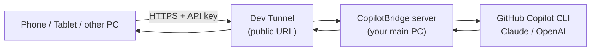

# CopilotBridge

**Use your AI coding subscription (GitHub Copilot CLI / Claude / OpenAI) from
any device — your phone, tablet, or another PC — by bridging it through your
main computer.**

CopilotBridge runs a tiny server on the machine where your AI CLI is installed,
then exposes it over a secure Microsoft **Dev Tunnel** so your other devices can
talk to it from anywhere. Install it with one click, sign in once, and you get a
URL + key to paste into the mobile/desktop apps.

<p align="center">
  
</p>



---

## Why use it

### 1. Share your AI subscription with all your devices — and vibe-code from your phone
You already pay for GitHub Copilot (or Claude / OpenAI) on your main computer.
CopilotBridge lets your **phone, tablet, or laptop** use that same subscription
remotely. Got an idea on the couch? Open the app on your phone, type a prompt,
and your home PC's Copilot does the work — real **vibe coding from your phone**,
backed by the full power of your desktop's tools and files.

### 2. One shared AI history across every device — save tokens and context
Every device talks to the **same** server, so they share **one set of
conversation histories**. Start a session on your laptop, continue it on your
phone, finish it on a tablet — the context is already there. No re-explaining,
no duplicate sessions, **less wasted compute and fewer tokens**.

Other niceties: persistent sessions that survive restarts, image attachments
(send a screenshot, the AI can see it), Markdown rendering, and a request queue
so multiple devices don't collide.

---

## Install (Windows, one click)

> You need this on the **host PC** — the computer that has your AI CLI
> (e.g. GitHub Copilot CLI) installed and signed in. Your other devices only
> need the client app or a browser.

1. **Download** the latest `CopilotBridgeServer-x.y.z-setup.exe` from the
   [**Releases**](../../releases/latest) page.
2. **Run the installer.** It installs to `Program Files`, adds Start-menu
   shortcuts, and launches the app. (Windows SmartScreen may warn for a new
   publisher — choose *More info → Run anyway*.)
3. **First-run setup wizard** (all in a window — no command line):
   - **Dev Tunnel** — click **Sign in** (free, opens your browser) so your phone
     can reach the server from anywhere. You can also skip for LAN-only.
   - **AI tool** — pick GitHub Copilot (recommended), Claude, etc.
   - Click **Start server →**.
4. A **Connection info** window appears with your **Server URL**, **API Key**,
   and provider — each with a **Copy** button. Paste these into the client app
   on your phone/PC (or open the Server URL in a phone browser for the built-in
   web app).

That's it. Closing the window keeps the server running in the background.

### Control Panel — start / stop / restart anytime

Open **Start menu → Copilot Bridge → Copilot Bridge Control Panel**. From one
window you can:

| Control | What it does |
| --- | --- |
| **Server: Start / Stop / Restart** | Manually control the CopilotBridge server. |
| **Dev Tunnel: Start / Stop / Restart** | Pause or re-establish the public URL (it also self-heals if it ever drops). |
| **Connection details + Copy** | See the current Server URL / Local URL / API Key. |

There's also a **View Connection Info** shortcut that shows the URL + key any
time without changing anything. The server keeps running in the background and
restarts at logon, so it's there whenever your devices need it.

---

## Connect a device

- **Phone (no install):** open the **Server URL** in your phone's browser → it
  loads the built-in web app (add it to your Home Screen for an app-like PWA).
  Paste the **API Key** once in Settings.
- **Windows client:** a native desktop app (see [`clients/windows/`](clients/windows/)).
  Enter the Server URL + API Key in Settings.
- **Android / iOS:** .NET MAUI apps under [`clients/`](clients/) (build from
  source; see [`clients/README.md`](clients/README.md)).

All clients share the same server, so they all see the same session history.

---

## Security (please read)

CopilotBridge is effectively **remote command execution** on the host PC: anyone
who has your Server URL **and** API Key can make the AI run commands and edit
files on that machine. So:

- Keep your **API Key** secret (it's generated uniquely per machine on first run).
- The default AI sandbox is the server's `workspace/` folder
  (`COPILOT_SCOPE=workdir`). Only widen it if you understand the risk.
- The Dev Tunnel URL is public but useless without the key. Stop the tunnel from
  the Control Panel when you don't need remote access.

---

## Run from source (developers)

```powershell
# 1. Install: venv + Python deps + bundle the Dev Tunnel CLI into tools/
.\scripts\install.ps1

# 2. Configure
Copy-Item server\.env.example server\.env   # then set a strong CHAT_API_TOKEN

# 3. One-time Dev Tunnel sign-in
.\tools\devtunnel.exe user login

# 4. Start server + tunnel together (staged startup logs)
.\scripts\run.ps1
```

Build the installer yourself: `.\scripts\build-installer.ps1 -Version x.y.z`
(produces `dist\CopilotBridgeServer-x.y.z-setup.exe`).

### Repository layout

| Path | What it is |
| --- | --- |
| [`server/`](server/) | Python aiohttp server, orchestrated launcher, GUI (setup wizard / connection info / Control Panel), Dev Tunnel + provider plumbing. |
| [`clients/`](clients/) | End-user apps: Windows (WPF) and Android / iOS (.NET MAUI). |
| [`installer/`](installer/) | Inno Setup script for the one-click installer. |
| [`scripts/`](scripts/) | Install, run, build-installer, publish, background-service scripts. |
| [`assets/`](assets/) | App icon (`icon.svg` / `icon.ico`). |
| [`docs/`](docs/) | Architecture, releasing, and deeper notes. |

### The HTTP API (used by every client)

| Route | Body | Returns |
| --- | --- | --- |
| `GET /health` | — | status JSON (no auth) |
| `POST /api/chat` | `{message, conversationId, reset?, images?}` | `{jobId}` |
| `GET /api/chat/{jobId}` | — | `{status, ok, reply, sessionId, title}` |
| `POST /api/chat-sync` | `{message, conversationId, ...}` | `{ok, reply, sessionId, title}` (waits) |
| `GET/POST /api/sessions`, `GET/PATCH/DELETE /api/sessions/{id}` | — | session list / detail CRUD |
| `GET /api/control/status`, `POST /api/control/shutdown`, `POST /api/control/tunnel` | — | local Control-Panel API |

`/api/chat*` and `/api/sessions*` require `X-API-Key: <token>` (or
`Authorization: Bearer`). Non-browser clients should also send
`X-Tunnel-Skip-AntiPhishing-Page: true`.

## Prerequisites (host PC)

- **An AI CLI**, installed and signed in — e.g. **GitHub Copilot CLI**
  (`copilot --version`), Claude CLI, or an OpenAI key. This is the subscription
  you're sharing.
- **Windows** for the one-click installer. (From source also needs **Python
  3.12+**; the Windows client needs the **.NET 9 SDK**.)
- **Dev Tunnels** — bundled with the installer; just sign in once.

## License

See [LICENSE](LICENSE).
