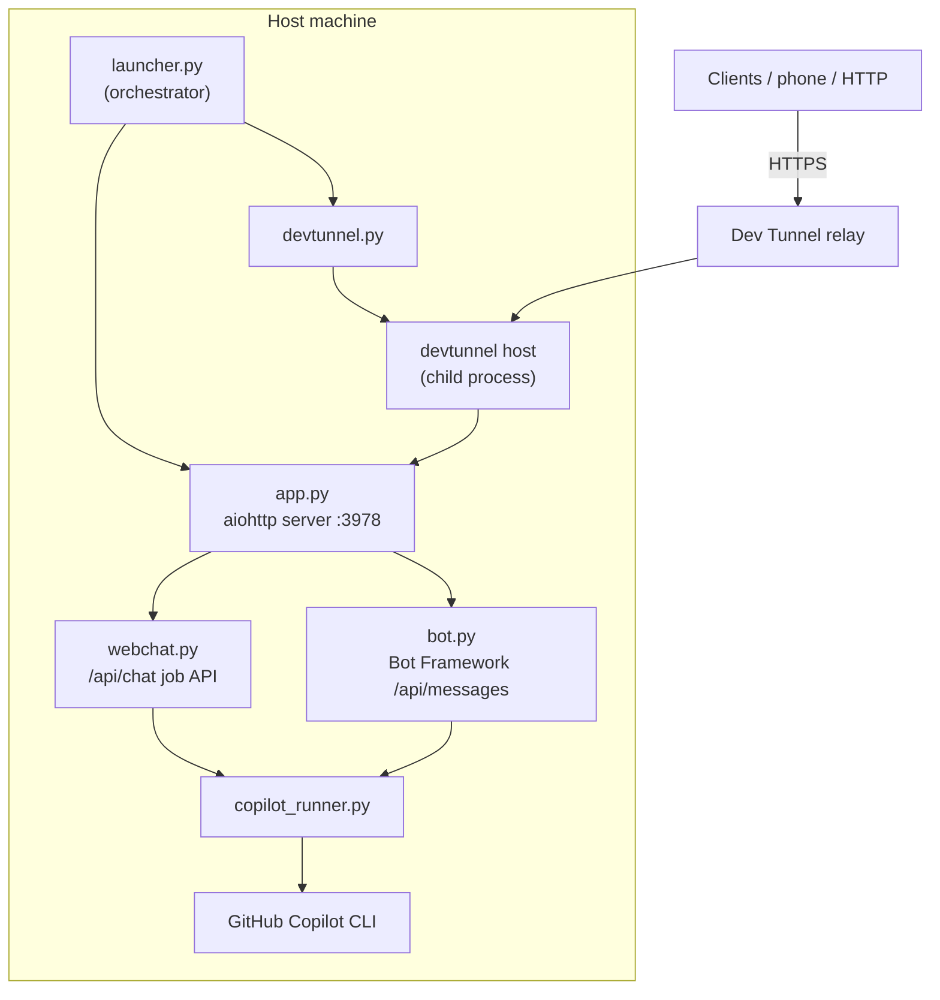

# Architecture

## Components

## Startup sequence (launcher.py)

The orchestrated launcher brings the server and tunnel up together and logs each stage:

1. **Configuration & app graph** — load `server/.env`, build the aiohttp app, wire the
   Copilot runner.
2. **Copilot CLI** — confirm the `copilot` executable is located.
3. **Dev Tunnel CLI** — discover `devtunnel` (bundled `tools/` → PATH → winget link).
4. **Bind + serve** — start listening on `HOST:PORT`.
5. **Readiness probe** — poll `/health` until it returns 200.
6. **Host the Dev Tunnel** — ensure the named tunnel + an **http** port mapping exist,
   then `devtunnel host` as a child process and capture the public URL.

On `Ctrl+C` the launcher stops the tunnel child process and cleanly shuts the server down.

## Why the tunnel port is `http`, not `https`

`devtunnel port create --protocol` describes the protocol the **local** service speaks.
The app server is plain HTTP, so the port must be `http`. Selecting `https` makes the relay
attempt a TLS handshake against the HTTP socket and every request fails with
**502 Bad Gateway** (the server logs a `BadStatusLine` on a TLS ClientHello). The public
tunnel URL is HTTPS either way — the relay terminates TLS.

## Sessions (server-authoritative, persistent)

`server/session_store.py` owns the conversation model. One session = one uuid that is
simultaneously the client `conversationId` and the Copilot CLI `--session-id` (1:1, immutable).

- **Storage:** one JSON file per session at `server/sessions/<id>.json` (title + full transcript),
  written atomically (temp file + `os.replace`). An in-memory index is rebuilt on startup; the
  store is guarded by a reentrant lock and the id is sanitized to prevent path traversal.
- **Flow:** `webchat.py` resolves `get_or_create(conversationId)`, appends the user message,
  runs Copilot with `session_id` == that uuid, then appends the assistant reply. The same uuid
  is returned to the client as `sessionId`.
- **New conversation:** `POST /api/sessions` mints a fresh uuid. `reset:true` on `/api/chat`
  also mints a new session and returns its id for the client to adopt (no reset-in-place).
- **Client sync:** clients list sessions from `GET /api/sessions` (authoritative) and may cache
  transcripts locally, reconciling against the server (server wins for existence + ordering).

## Image attachments

Clients can attach images to a turn (`images:[{name, mime, data}]` on `/api/chat` or
`/api/chat-sync`; `data` is base64 or a `data:` URL). `webchat.py` base64-decodes and validates
each (type allow-list + size), saves it to `server/workspace/.uploads/<sessionId>/` (inside the
Copilot `--add-dir` sandbox), and passes the file path to `copilot_runner.py`, which adds one
`--attachment <path>` argument per image — the CLI's native way to give the model vision. The
saved files are recorded on the user message as `attachments[]` (name/mime/url/size) and served
read-only via `GET /api/uploads/{sid}/{file}`; that route also accepts a `?key=` query token so
plain `` tags (which can't set headers) work. Caps: `MAX_ATTACHMENT_MB`, `MAX_ATTACHMENTS`.

## Auth & security model

- **`/api/chat*`** is gated by `CHAT_API_TOKEN` (sent as `X-API-Key` or `Authorization: Bearer`).
  Empty token = open access (anyone with the URL can run Copilot) — only for throwaway local tests.
- **`/api/messages`** (Bot Framework/Teams) validates the inbound JWT when `MicrosoftAppId`
  is set, and restricts users via `ALLOWED_USER_IDS`.
- **Copilot sandbox** — `COPILOT_SCOPE=workdir` confines file access to `server/workspace/`.
  `full` grants whole-machine access (`--allow-all`); use deliberately.
- **Dev Tunnel** anonymous access is required for remote clients; the API token is the real
  gate. Rotate the token to revoke access.

## Configuration (server/.env)

See [server/.env.example](../server/.env.example) for the full list. Key settings:

| Var | Meaning |
| --- | --- |
| `CHAT_API_TOKEN` | Shared secret for `/api/chat*`. |
| `MAX_ATTACHMENT_MB` | Per-image upload size cap (MB, default 25). |
| `MAX_ATTACHMENTS` | Max images per chat turn (default 8). |
| `COPILOT_SCOPE` | `workdir` (sandbox) or `full`. |
| `TUNNEL_ENABLED` | Auto-start the Dev Tunnel from the launcher. |
| `TUNNEL_ID` | Stable tunnel name → stable public URL. |
| `DEVTUNNEL_PATH` | Override devtunnel discovery. |
