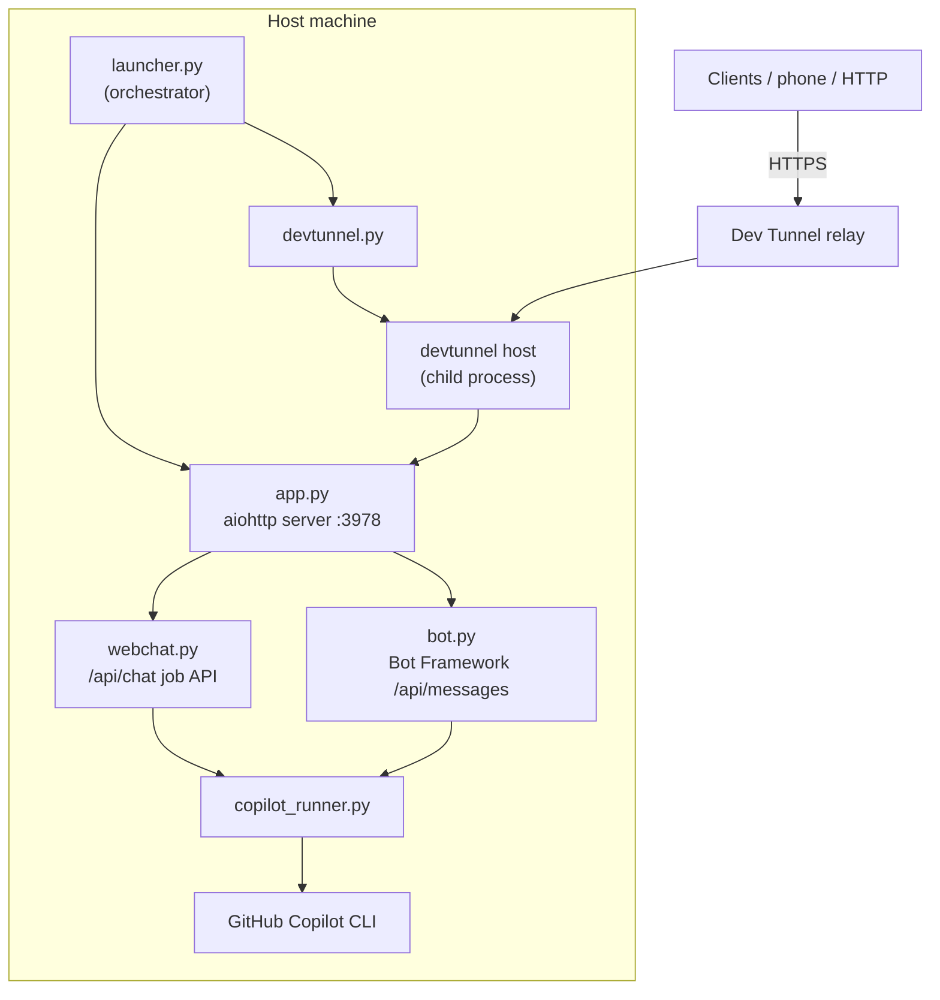

# Architecture

## Components

## Startup sequence (launcher.py)

The orchestrated launcher brings the server and tunnel up together and logs each stage:

1. **Configuration & app graph** — load `server/.env`, build the aiohttp app, wire the
   Copilot runner.
2. **Copilot CLI** — confirm the `copilot` executable is located.
3. **Dev Tunnel CLI** — discover `devtunnel` (bundled `tools/` → PATH → winget link).
4. **Bind + serve** — start listening on `HOST:PORT`.
5. **Readiness probe** — poll `/health` until it returns 200.
6. **Host the Dev Tunnel** — ensure the named tunnel + an **http** port mapping exist,
   then `devtunnel host` as a child process and capture the public URL.

On `Ctrl+C` the launcher stops the tunnel child process and cleanly shuts the server down.

The interactive installer starts the launcher with `--notification-setup`. After the local
server is ready, the launcher opens
`/?dashboard=1&notificationSetup=1&syncSetup=1` in the default browser. The Dashboard combines
browser-notification consent with explicit OneDrive account selection. Chromium requires
`Notification.requestPermission()` to follow a user gesture, and OneDrive authorization must
also remain an explicit user choice. An upgrade can open this onboarding page without rerunning
the full setup wizard.

## Why the tunnel port is `http`, not `https`

`devtunnel port create --protocol` describes the protocol the **local** service speaks.
The app server is plain HTTP, so the port must be `http`. Selecting `https` makes the relay
attempt a TLS handshake against the HTTP socket and every request fails with
**502 Bad Gateway** (the server logs a `BadStatusLine` on a TLS ClientHello). The public
tunnel URL is HTTPS either way — the relay terminates TLS.

## Sessions (server-authoritative, persistent)

`server/session_store.py` owns the local SQLite database at
`server/sessions/copilotbridge.db` (or the equivalent writable app-data directory in a
packaged build). WAL mode permits concurrent readers while one serialized writer updates
the store.

- **Identity:** the client `conversationId` is a Bridge-owned UUID. Device-scoped
  `external_refs` identify imported CLI/VS Code sessions; `execution_bindings` map a Branch
  to the provider-native id used to run it. These id namespaces are never interchangeable.
- **Native discovery:** CLI, VS Code Stable, and VS Code Insiders records use source-qualified
  keys, so identical native UUIDs do not overwrite each other. VS Code transcript rows come
  from `github.copilot-chat/session-store.db`; pinned titles and change statistics come from
  the Workbench `state.vscdb` entry `chat.ChatSessionStore.index`.
- **Conversation structure:** every user request creates a stable Turn UUID. User, assistant,
  and future tool messages point to that Turn, enabling prompt previews and message-level
  deep links without relying on array positions.
- **Legacy migration:** existing `sessions/<id>.json` files are imported idempotently and
  retained as rollback backups. Imported records and their native source references are
  added to the transactional sync outbox.
- **Flow:** `webchat.py` resolves the Bridge conversation, captures prior history, appends the
  user message, runs the provider through its local execution binding, then appends the reply.
- **New conversation:** `POST /api/sessions` mints a fresh uuid. `reset:true` on `/api/chat`
  also mints a new session and returns its id for the client to adopt (no reset-in-place).
- **Client sync:** clients list sessions from `GET /api/sessions` (authoritative) and may cache
  transcripts locally, reconciling against the server (server wins for existence + ordering).

### Session organization (v2.3)

The `conversations` row also owns user organization metadata: favorite, pin,
project, and labels. `PATCH /api/sessions/{id}` validates and updates these fields.
Organization changes have an independent `organization_updated_at` clock and are
uploaded as complete `conversation/organized` event snapshots, so a later message
or title update cannot accidentally erase organization choices made on another
device. Remote events use last-write-wins only within this organization surface.

The session summary projects `awaitingResponse` from the last message role. The
product center combines that value with update time, device origin, project, and
labels to provide recent, waiting, device, and project filters without duplicating
conversation data.

## Product center (v2.3)

The web app retains the established chat DOM and APIs, then layers a responsive
product shell from `webapp/v23.css` and `webapp/v23.js`:

- **Inbox:** real `/api/dashboard` and `/api/inbox` records, transcript detail,
  complete, remind-later, bulk-complete, open, and native-import actions.
- **Sessions:** organization controls and filters backed by SQLite and sync events.
- **Conversation:** the existing Markdown chat, attachments, queue, and Turn timeline.
- **Settings:** actual OneDrive state, devices represented by synchronized sessions,
  notification permission, authentication policy, and connection settings.

Reminder timestamps migrate in place on `inbox_items`. A reminded item remains
seen until its timestamp is due; the next Inbox or Dashboard read atomically moves
it back to unread. This avoids a second timer service while retaining durable
behavior across process restarts.

The service worker caches the versioned shell assets. Desktop uses a 72-pixel
navigation rail; at 700 pixels and below the same actions move to bottom navigation,
with full-width Inbox details and wrapped session filters.

## Evidence-backed Knowledge Hub (v2.4)

Schema version 3 adds `knowledge_items`, `knowledge_versions`, and
`knowledge_evidence` without rewriting existing conversations, Turns, or messages.
The current message and Turn UUIDs are the provenance anchors:

- a knowledge item owns type, title, lifecycle status, project, labels, and a pointer
  to its current immutable version;
- every version owns Markdown content, an input digest, extractor version, confidence,
  and a monotonically increasing item-local version number;
- every version must cite at least one real `messages.id`; evidence also stores its
  conversation, branch, Turn, and a bounded source snippet.

Knowledge creation validates all evidence before opening a transaction. The item,
version, evidence rows, and their `knowledge_item`, `knowledge_version`, and
`knowledge_evidence` Outbox events commit atomically. Pull applies those entities in
event order without writing a new local Outbox event. Item deletion is a synchronized
tombstone; evidence remains queryable only while its item is active.

The Knowledge Hub uses `GET/POST /api/knowledge`, item CRUD, append-version, and
per-session list routes. Manual creation is deliberately evidence-first and creates a
draft; it does not run the normal tool-enabled chat runner. Evidence links use
`?conversation=<id>&turn=<turn-id>&message=<message-id>` and the web client attaches
stable message ids to transcript DOM nodes, so navigation highlights the exact source
message rather than only the surrounding Turn.

## Incremental knowledge extraction (v2.5)

Schema version 4 adds the local-only `knowledge_extraction_runs` ledger. A run records
the conversation, extractor version, deterministic input digest, source message ids,
and result item ids. The ledger itself is not synchronized: each device derives from
the stable messages it has locally, while accepted knowledge continues through the
normal transactional Outbox.

`POST /api/sessions/{id}/knowledge/extract` serializes work per conversation:

1. Select stable user/assistant messages not processed by this extractor version and
  apply bounded message and character limits.
2. Return the prior result without a provider call when there are no new messages.
3. Invoke a dedicated extractor that has no chat tools. Copilot CLI is launched with
  `--available-tools=`, `--no-ask-user`, and `--disallow-temp-dir`; its batch is capped at
  12,000 source characters and the escaped command line is checked before launch to stay
  below Windows limits. OpenAI uses a strict JSON Schema request and no tools.
4. Parse JSON with duplicate-key detection, reject unknown fields and out-of-batch
  evidence ids, then atomically create draft items or append immutable versions.
5. Commit the run ledger in the same SQLite transaction. Provider or validation errors
  therefore leave both knowledge and the processed-message watermark unchanged.

The normal chat provider remains independently configured and may retain its existing
tool permissions. Knowledge reuse is also explicit: the UI inserts a bounded context
into the current composer for review and never sends it automatically.

## Cross-conversation history map (v2.6)

Schema version 5 adds the local-only, rebuildable `knowledge_maps` cache. The single
`history` row stores normalized map JSON together with the sampled input digest,
extractor version, source conversation/message ids, and coverage counts. It is not a
new knowledge source: persisted messages remain authoritative and hydrate every node's
evidence at read time. Missing messages are reported through `missingEvidenceCount`.

`POST /api/knowledge/map/generate` builds the map as follows:

1. Select meaningful sessions with balanced recent/older coverage, filter obvious
  command and test noise, and sample bounded user/assistant messages.
2. Compute a deterministic digest. An unchanged digest plus extractor version returns
  the cached map unless the caller explicitly requests `force`.
3. Invoke the dedicated tool-free extractor with the sampled message ids as an allow
  list. The model returns a hierarchy of topic, project, goal, decision, practice,
  problem, solution, failure, question, and todo nodes.
4. Strictly parse the complete JSON document, reject unknown fields, duplicate keys,
  invalid parent graphs, excess nodes, and any evidence outside the allow list. One
  retry is allowed for malformed or out-of-scope model output.
5. Save only a fully validated result. A failed forced generation leaves the prior
  cache unchanged. `GET /api/knowledge/map` returns that cache with hydrated evidence.

The optional `focusConversationId` includes that conversation even when it is short,
places it first, and samples up to 40 evenly distributed messages before the balanced
global context. The UI's book-and-sparkle action first drains incremental extraction
batches for the selected conversation, then forces this focused map refresh. Repeating
the action processes only messages beyond the extraction ledger; matching item titles
receive immutable versions and remain searchable through the Knowledge Hub item list.

The Knowledge Hub opens on this map while retaining the v2.5 item list as a secondary
view. Search keeps matching branches in context, folding is local UI state, and source
links use the existing conversation/Turn/message deep link. Reuse fills and focuses the
current composer for review; it never creates a session or sends a chat request.

## Prompt timeline

`GET /api/sessions/{id}/turns` returns one preview per user Turn. The preview is projected
from the complete message at query time; `promptPreviewLength` defaults to 200 and is changed
through `GET/PATCH /api/settings`. The PWA deep-links to
`?conversation=<id>&turn=<turn-id>` and scrolls to the exact user/assistant exchange.
Knowledge evidence adds `&message=<message-id>` for message-level precision.

## Session watcher and unified inbox

`server/session_watcher.py` polls the read-only Copilot CLI, VS Code, and VS Code
Insiders adapters. The first observation establishes a cursor without creating historical
alerts. Later assistant responses must be reported complete by the source and remain stable
for `SESSION_WATCHER_SETTLE_SCANS` scans before one deduplicated `inbox_items` row is created.

- Copilot CLI completion is derived from `assistant.turn_start` / `assistant.turn_end` and
  pending permission events in `events.jsonl`.
- VS Code completion uses the persisted `ResponseModelState` in
  `chat.ChatSessionStore.index` (`Pending`, `Complete`, `Cancelled`, `Failed`, `NeedsInput`).
- Bridge-owned asynchronous jobs write to the same inbox immediately on completion or error.
- Inbox rows and per-source watch cursors live in SQLite, so restarts do not duplicate or lose
  attention state.

The PWA's AI Dashboard shows unread replies, active Bridge jobs, watched session count, source
labels, manual scan, and read/ignored states. It polls every five seconds and can emit browser
notifications while the PWA is open in the foreground or background. Without a cloud push
service, a fully closed browser cannot receive a new notification; the persisted inbox appears
the next time it opens.

Clicking an inbox item opens or imports the corresponding Bridge conversation. Stable VS Code
APIs do not provide a supported external deep link to an existing Copilot Chat turn, so exact
activation inside VS Code remains a future Companion Extension capability.

## Modular synchronization foundation

Every local mutation and its `sync_events` outbox row commit in the same SQLite transaction.
`server/sync/` encodes ordered events into versioned, gzip-compressed, SHA-256-verified,
immutable `.cbe` packages. `server/transports/` exposes a provider-neutral object contract:
list by prefix, put-if-absent, get, exists, and diagnostics.

`FileSystemTransport` supports local directories and mounted SMB/Samba shares.
`OneDriveGraphTransport` implements the same contract through Microsoft Graph's App Folder;
S3, SFTP, or other providers can be added without changing the sync engine or conversation
model. Each device writes only its own path under
`spaces/<space>/v1/devices/<device>/events/`. Pull applies events idempotently and advances a
per-device cursor in the same transaction without writing those remote changes back to the
local outbox.

### First sync when Laptop B already has history

`SyncCoordinator.first_sync()` always performs this deterministic sequence:

1. Read CLI, VS Code, and VS Code Insiders stores without modifying them.
2. Sort source-qualified native ids and import any missing local sessions idempotently.
3. Drain B's transactional Outbox completely into B-owned immutable packages.
4. List, verify, and apply packages previously uploaded by A and other devices.
5. Preserve remote-origin native ids as device-scoped references; do not treat them as locally
  resumable sessions.

Thus first installation computes $A \cup B$ rather than choosing a winner. Repeating the whole
sequence is a no-op. `SyncService` uses this same path immediately after authorization, at
startup when a cached account exists, on manual request, and every 15 minutes by default.

The native Tk Control Panel calls the same localhost-only sync API and never handles Graph
tokens itself. It displays account, pending-event, and last-result state and exposes Open AI
Dashboard, Connect OneDrive, Upload + download now, and Disconnect. Network and process work
runs on worker threads; only the queue-driven UI pump mutates Tk widgets.

OneDrive authentication uses MSAL Authorization Code + PKCE with delegated
`Files.ReadWrite.AppFolder`. The serialized MSAL refresh-token cache is encrypted with Windows
DPAPI under the current user and stored outside SQLite. The app registration is a public client
and contains no client secret.

`ONEDRIVE_TRANSPORT=auto` selects Graph only when a publisher-owned Client ID is configured.
Otherwise Windows work/personal OneDrive roots are detected from supported environment and
account registry metadata, and `FileSystemTransport` writes the same immutable object tree to
`<OneDrive>\Apps\Copilot Bridge`. Local-folder mode persists a separate explicit opt-in marker;
detecting a signed-in OneDrive never silently uploads data. This fallback avoids treating an
unrelated tenant-local test registration as a multi-tenant production application.

## Image attachments

Clients can attach images to a turn (`images:[{name, mime, data}]` on `/api/chat` or
`/api/chat-sync`; `data` is base64 or a `data:` URL). `webchat.py` base64-decodes and validates
each (type allow-list + size), saves it to `server/workspace/.uploads/<sessionId>/` (inside the
Copilot `--add-dir` sandbox), and passes the file path to `copilot_runner.py`, which adds one
`--attachment <path>` argument per image — the CLI's native way to give the model vision. The
saved files are recorded on the user message as `attachments[]` (name/mime/url/size) and served
read-only via `GET /api/uploads/{sid}/{file}`. Legacy `apikey` mode also accepts a `?key=` query
token so plain `` tags (which can't set headers) work. Caps: `MAX_ATTACHMENT_MB`,
`MAX_ATTACHMENTS`.

## Auth & security model

- **Local web/API access** binds to loopback and requires no login in default `tunnel` mode.
- **Remote web/API access** crosses a private Dev Tunnel whose relay requires the tunnel owner's
  Microsoft account before forwarding any request.
- **Control API access** remains gated by `CHAT_API_TOKEN`; that secret is not injected into web pages.
- **`/api/messages`** (Bot Framework/Teams) validates the inbound JWT when `MicrosoftAppId`
  is set, and restricts users via `ALLOWED_USER_IDS`.
- **Copilot sandbox** — `COPILOT_SCOPE=workdir` confines file access to `server/workspace/`.
  `full` grants whole-machine access (`--allow-all`); use deliberately.
- **Fail-closed fallback** — `AUTH_MODE=tunnel` falls back to API-key authentication when `HOST`
  is non-loopback or `TUNNEL_AUTH=anonymous`.

## Configuration (server/.env)

See [server/.env.example](../server/.env.example) for the full list. Key settings:

| Var | Meaning |
| --- | --- |
| `AUTH_MODE` | `tunnel` (default), `apikey`, `entra`, or `both`. |
| `CHAT_API_TOKEN` | Host-only control secret; also protects legacy `apikey` mode. |
| `MAX_ATTACHMENT_MB` | Per-image upload size cap (MB, default 25). |
| `MAX_ATTACHMENTS` | Max images per chat turn (default 8). |
| `COPILOT_SCOPE` | `workdir` (sandbox) or `full`. |
| `TUNNEL_ENABLED` | Auto-start the Dev Tunnel from the launcher. |
| `TUNNEL_ID` | Stable tunnel name → stable public URL. |
| `TUNNEL_AUTH` | `private` (default), `tenant`, `anonymous`, or `org:<name>`. |
| `DEVTUNNEL_PATH` | Override devtunnel discovery. |
| `SESSION_WATCHER_ENABLED` | Enable native CLI/VS Code response monitoring. |
| `SESSION_WATCHER_INTERVAL` | Poll interval in seconds (default 5). |
| `SESSION_WATCHER_SETTLE_SCANS` | Unchanged scans required before alerting (default 1). |
| `KNOWLEDGE_EXTRACTION_ENABLED` | Enable the explicit tool-free extraction endpoint. |
| `KNOWLEDGE_EXTRACTION_PROVIDER` | `auto`, `copilot`, `openai`, or `disabled`. |
| `KNOWLEDGE_EXTRACTION_MODEL` | Optional model override for the extraction provider. |
| `KNOWLEDGE_EXTRACTION_TIMEOUT` | Provider timeout in seconds (default 180). |
| `KNOWLEDGE_EXTRACTION_MAX_ITEMS` | Maximum accepted findings per batch (default 12). |
| `KNOWLEDGE_EXTRACTION_MAX_CHARS` | Maximum input characters per batch (default 45000). |
| `KNOWLEDGE_EXTRACTION_MAX_MESSAGES` | Maximum source messages per batch (default 120). |
| `KNOWLEDGE_MAP_MAX_CONVERSATIONS` | Maximum sampled history conversations (default 48). |
| `KNOWLEDGE_MAP_MAX_CHARS` | Maximum serialized map input characters (default 22000). |
| `KNOWLEDGE_MAP_MAX_NODES` | Maximum accepted map nodes (default 48). |
| `ONEDRIVE_SYNC_ENABLED` | Enable the OneDrive sync service. |
| `ONEDRIVE_TRANSPORT` | `auto`, `graph`, or `local-folder`. |
| `ONEDRIVE_CLIENT_ID` | Publisher-owned multi-tenant Public Client id. |
| `ONEDRIVE_TENANT_ID` | OAuth authority tenant (`common` by default). |
| `ONEDRIVE_LOCAL_ROOT` | Optional explicit local OneDrive root. |
| `ONEDRIVE_SYNC_SPACE_ID` | Logical sync namespace inside the App Folder. |
| `ONEDRIVE_SYNC_INTERVAL` | Background interval in seconds (default 900). |
